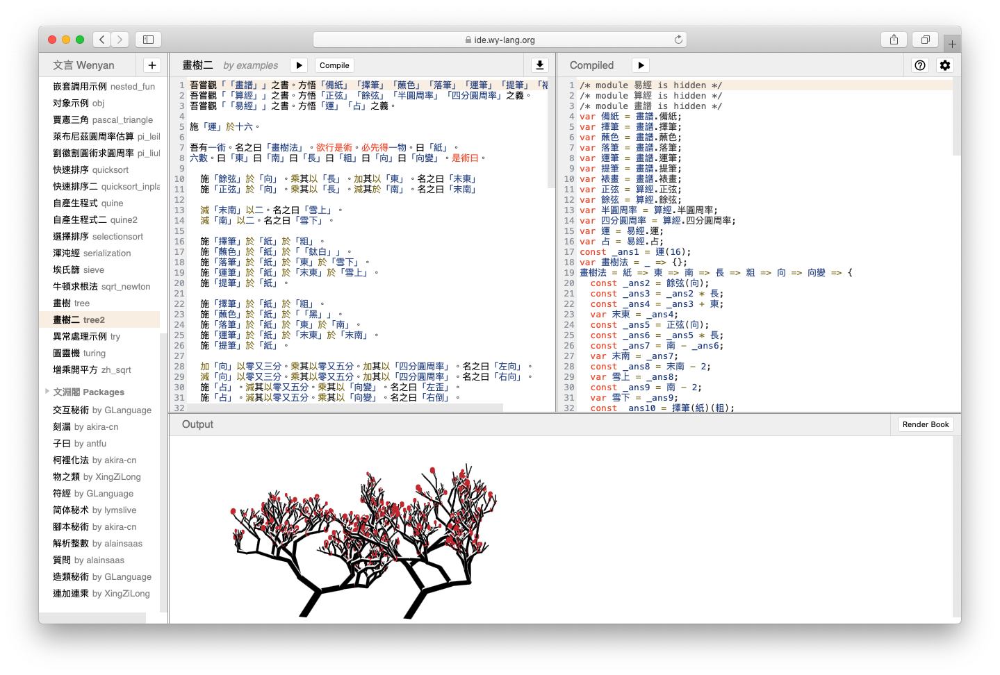

# 文言 wenyan-lang

### [wy-lang.org](https://wy-lang.org) | [Wiki](https://github.com/wenyan-lang/wenyan/wiki)

[English](./README.md) | 简体中文 | [繁體中文](./README.zh-Hant.md)

文言文編程語言。 [在线体验](http://wenyan-lang.lingdong.works/ide.html)

> 🚧 请注意，中文版文档并非实时更新，仅供参考。如有歧义，请以英文版文档为主。


## 序

> 夫[唐](https://en.wikipedia.org/wiki/Emperor_Yao)、[虞](https://en.wikipedia.org/wiki/Emperor_Shun)之世，[結繩而足治](https://ctext.org/book-of-changes/xi-ci-xia/zh)，屈指而足算。是時豈料百代之後，計算機械之巧，精於[公輸](https://en.wikipedia.org/wiki/Lu_Ban)之[木鳶](https://en.wikipedia.org/wiki/Lu_Ban#Inventions)，善於[武侯](https://en.wikipedia.org/wiki/Zhuge_Liang)之[流馬](https://en.wikipedia.org/wiki/Wooden_ox)；程式語言之多，繁若[《天官》](https://ctext.org/shiji/tian-guan-shu/zh)之星宿，奇勝[《山經》](https://en.wikipedia.org/wiki/Classic_of_Mountains_and_Seas)之走獸。[鼠](https://golang.org/)、[蟹](https://www.rust-lang.org/)、[鑽](http://ruby-lang.org/)、[魚](https://fishshell.com/)，或以速稱。[蛇](https://www.python.org/)、[象](https://www.php.net/)、[駱](https://www.perl.org/)、[犀](http://shop.oreilly.com/product/9780596805531.do)，各爭文采。方知[鬼之所以夜哭，天之所以雨粟](https://ctext.org/huainanzi/ben-jing-xun/zh)。然以文言編程者 ，似所未有。此誠非文脈之所以傳，文心之所以保。[嗟予小子](https://zh.wikisource.org/zh-hant/%E6%A6%AE%E6%9C%A8_(%E9%99%B6%E6%B7%B5%E6%98%8E))，遂有斯志。然則數寸之烏絲猶覆於頭，[萬卷之素書未破於手](https://zh.wikisource.org/zh-hant/%E5%A5%89%E8%B4%88%E9%9F%8B%E5%B7%A6%E4%B8%9E%E4%B8%88%E4%BA%8C%E5%8D%81%E4%BA%8C%E9%9F%BB)；一身長羁于远邦，兩耳久旷于[雅言](https://zh.wikipedia.org/wiki/%E9%9B%85%E9%9F%B3)。然夫文章者吾之所宿好，程式者偶承時人之謬譽。故[希孟](https://en.wikipedia.org/wiki/Wang_Ximeng)不慚年少，[莊生](https://en.wikipedia.org/wiki/Zhuang_Zhou)不望[無涯](https://ctext.org/zhuangzi/nourishing-the-lord-of-life/zh)。乃作斯言。誠未能嘔瀝[長吉](https://en.wikipedia.org/wiki/Li_He)之[心血](https://zh.wikisource.org/zh-hant/%E6%9D%8E%E8%B3%80%E5%B0%8F%E5%82%B3)，亦庶幾免於[義山](https://en.wikipedia.org/wiki/Li_Shangyin)之[流沫](https://zh.wikisource.org/zh-hant/%E9%9F%93%E7%A2%91)。既成之後，復學[干將鑄劍](https://zh.wikisource.org/wiki/%E9%91%84%E5%8A%8D)而自飼，[越王嚐糞](https://ctext.org/wu-yue-chun-qiu/yue-wang-gou-jian-wu-nian/zh)而當先。自謂偶追[《十書》](https://en.wikipedia.org/wiki/Ten_Computational_Canons)之筆意，但恨少[八家](https://en.wikipedia.org/wiki/Eight_Masters_of_the_Tang_and_Song)之淋漓。此[子山](https://en.wikipedia.org/wiki/Yu_Xin)所謂[士衡抚掌而甘心，平子見陋而固宜](https://zh.wikisource.org/zh-hant/%E5%93%80%E6%B1%9F%E5%8D%97%E8%B3%A6)。然則雖實[覆甕](https://zh.wikisource.org/zh-hant/%E6%99%89%E6%9B%B8/%E5%8D%B7092#%E5%B7%A6%E6%80%9D)之質，尚存斧正之望；雖乏[呂相](https://en.wikipedia.org/wiki/L%C3%BC_Buwei)之金，[易字](https://zh.wikisource.org/zh/%E5%8F%B2%E8%A8%98/%E5%8D%B7085)之渴蓋同。此亦開源之大義，吾輩之所以勉勵也。一笑。


## Helloworld

文言:

```
吾有一數。曰三。名之曰「甲」。
為是「甲」遍。
	吾有一言。曰「「問天地好在。」」。書之。
云云。
```
等同于以下 JavaScript:

```JavaScript
var n = 3;
for (var i = 0; i < n; i++) {
	console.log("問天地好在。");
}
```

输出:

```
問天地好在。
問天地好在。
問天地好在。
```

标点符号和换行都是可选的（就像古汉语中文字是连续的），所以上面的代码等同于：


```
吾有一數曰三名之曰「甲」為是「甲」遍吾有一言曰「「問天地好在」」書之云云
```

更多复杂的例子，可以在 `./examples` 中找到。比如，埃拉托斯特尼筛法、快速排序、曼德博集合、汉诺塔。


## 特点
- 符合[古汉语](https://en.wikipedia.org/wiki/Classical_Chinese)语法的自然语言处理程序
- 可以编译成 [JavaScript](https://developer.mozilla.org/en-US/docs/Web/JavaScript)，[Python](https://python.org)，或者 [Ruby](http://ruby-lang.org)
- [图灵完备](https://github.com/LingDong-/wenyan-lang/blob/master/examples/turing.wy)
- [在线 IDE](http://wenyan-lang.lingdong.works/ide.html)，即刻体验
- 通过[几个例子](https://github.com/LingDong-/wenyan-lang/tree/master/examples)快速入门


## 安装

### 编译器

使用以下命令安装本编译器：

```bash
npm install -g @wenyan/cli
```

尝试运行内置的例子，例如：

```bash
wenyan examples/helloworld.wy -o helloworld.js
```


### [在线 IDE](http://wenyan-lang.lingdong.works/ide.html)




### 编辑器插件：

- 由[antfu](https://github.com/antfu)提供的[适用于VSCode的插件](https://github.com/antfu/wenyan-lang-vscode)
- 由[voldikss](https://github.com/voldikss)提供的[适用于Vim的插件](https://github.com/voldikss/vim-wenyan)
- 由[absop](https://github.com/absop)提供的[适用于Sublime Text的插件](https://github.com/absop/SublimeWenyan)


## 语法表

上下文无关文法的语法描述还在构建中。同时，请查阅下面的语法表，或者在 `src/parser.js` 中学习其他更多语法。当然你也可以从在线 IDE 现有的例子中学习更多语法知识！

### 变量

| wenyan | JavaScript |
|---|---|
|`吾有一數。曰三。名之曰「甲」。` | `var a = 3;` |
|`有數五十。名之曰「大衍」。` | `var dayan = 50;` |
|`昔之「甲」者。今「大衍」是也。` | `a = dayan;` |
|`吾有一言。曰「「噫吁戲」」。名之曰「乙」。` | `var b = "alas!";` |
|`吾有一爻。曰陰。名之曰「丙」。` | `var c = false;` |
|`吾有一列。名之曰「丁」。` | `var d = [];` |
|`吾有三數。曰一。曰三。曰五。名之曰「甲」曰「乙」曰「丙」。` | `var a=1,b=3,c=5;` |


### 流程控制

| wenyan | JavaScript |
|---|---|
|`若三大於二者。乃得「「想當然耳」」也。` | `if (3>2){ return "of course"; }` |
|`若三不大於五者。乃得「「想當然耳」」。若非。乃得「「怪哉」」也。` | `if(3<=5){return "of course"}else{return "no way"}` |
|`為是百遍。⋯⋯ 云云。` | `for (var i = 0; i < 100; i++){ ... }` |
|`恆為是。⋯⋯ 云云。` | `while (true) { ... }` |
|`凡「天地」中之「人」。⋯⋯ 云云。` | `for (var human of world){ ... }` |
|`乃止。` | `break;` |


### 运算

| wenyan | JavaScript |
|---|---|
|`加一以二。` | `1+2` |
|`加一於二。` | `2+1` |
|`加一以二。乘其以三。` | `(1+2)*3` |
|`除十以三。所餘幾何。` | `10%3` |
|`減七百五十六以四百三十三。名之曰「甲」。` | `var a = 756-433;` |
|`夫「甲」「乙」中有陽乎。` | `a \|\| b` |
|`夫「甲」「乙」中無陰乎。` | `a && b` |


### 容器
数组下标从一开始。而不是零。

| wenyan | JavaScript |
|---|---|
|`吾有一列。名之曰「甲」。充「甲」以四。以二。` | `var a = []; a.push(4, 2);` |
|`銜「甲」以「乙」。以「丙」` | `a.concat(b).concat(c);` |
|`夫「甲」之一。` | `a[0]` |
|`夫「甲」之其餘。` | `a.slice(1);` |
|`夫「玫瑰」之「「名」」。` | `rose["name"]` |
|`夫「寶劍」之長。` | `sword.length;` |


### 对象

| wenyan | JavaScript |
|---|---|
|`吾有一物。名之曰「甲」。` | `var a = {};` |
|`吾有一物。名之曰「甲」。其物如是。物之「「乙」」者。數曰三。物之「「丙」」者。言曰「「丁」」。是謂「甲」之物也。` | `var a = {b:3, c:"d"}` |


### 函数

| wenyan | JavaScript |
|---|---|
|`吾有一術。名之曰「吸星大法」。是術曰。⋯⋯是謂「吸星大法」之術也。`|`function f(){...}`|
|`吾有一術。名之曰「六脈神劍」。欲行是術。必先得六數。曰「甲」。曰「乙」。曰「丙」。曰「丁」。曰「戊」。曰「己」乃行是術曰。⋯⋯是謂「六脈神劍」之術也。`|`function f(a,b,c,d,e,f){...}`|
|`吾有一術。名之曰「翻倍」。欲行是術。必先得一數。曰「甲」。乃行是術曰。乘「甲」以二。名之曰「乙」。乃得「乙」。是謂「翻倍」之術也。`|`function double(a){var b = a * 2; return b;}`|
|`施「翻倍」於「大衍」。`|`double(dayan);`|
|`吾有一術。名之曰「甲」。欲行是術。必先得一數曰「乙」。二言。曰「丙」。曰「丁」`|`function a(float b, string c, string d)`|
|`夫「甲」。夫「乙」。夫「丙」。取二以施「丁」。取二以施「戊」。名之曰「己」。` | `var f = e(a,d(b,c))`|
|`夫「甲」。夫「乙」。夫「丙」。取二以施「丁」。取二以施「戊」。取一以施「己」。夫「庚」。夫「辛」。取三以施「壬」。名之曰「癸」。` | `var j = i(f(e(a,d(b,c))),g,h)`|

### 导入

| wenyan | JavaScript |
|---|---|
|`吾嘗觀「「算經」」之書。方悟「正弦」「餘弦」之義。` | `var {sin,cos} = require("math");` |

### 杂项

| wenyan | JavaScript |
|---|---|
|`吾有一數。曰五。書之。`|`console.log(5);`|

### 注释

| wenyan | JavaScript |
|---|---|
|`批曰。「「文氣淋灕。字句切實」」。` | `/*文氣淋灕。字句切實*/` |
|`注曰。「「文言備矣」」。` | `/*文言備矣*/` |
|`疏曰。「「居第一之位故稱初。以其陽爻故稱九」」。` | `/*居第一之位故稱初。以其陽爻故稱九*/` |


## 渲染器

```bash
wenyan examples/turing.wy --render 圖靈機 --output .
```

`src/render.js` 脚本文件能把 `wy` 代码格式化输出成为古汉语书籍样式（历史印刷书籍）的矢量图（SVG）。同时它还可以将生成的SVG文件解析回原始文言代码。需要获取更详细的信息，请使用`wenyan -h`命令来获取帮助。

下图是用 wenyan 编写的 通用图灵机程序 渲染而成。


## 功能请求

在你打开一个新Issue之前，请先检查你的需求是否属于以下类别：

|名称|优先级|需要帮助|状态|
|---|---|---|---|
|[语言规范](https://github.com/LingDong-/wenyan-lang/issues/1)|  ***** | | 正在进行中 |
|[类](https://github.com/LingDong-/wenyan-lang/issues/31) / [对象文法](https://github.com/LingDong-/wenyan-lang/issues/20) |  *** | | 对象文法已经添加 |
|[导入语句](https://github.com/LingDong-/wenyan-lang/issues/100) |  *** | | 导入语句已经添加 |
|标准库 ([Math(数学)](https://github.com/LingDong-/wenyan-lang/issues/55)/[Bitwise ops(位运算)](https://github.com/LingDong-/wenyan-lang/issues/2)/[Random(随机)](https://github.com/LingDong-/wenyan-lang/issues/87)) |  ***** | √ | 正在进行中 |
|[测试套件](https://github.com/LingDong-/wenyan-lang/issues/38)|  **** | √ | 正在进行中 |
|[Switch语句](https://github.com/LingDong-/wenyan-lang/issues/53)|  *** | | |
|[函数式程序设计](https://github.com/LingDong-/wenyan-lang/issues/99) |  *** | | |
|更严格的编译器 |  **** | | |
|其他语言的编译器 |  ** | √ | |
|[编辑器的插件](https://github.com/LingDong-/wenyan-lang/issues/77) |  ** | √ | 适用于VSCode, Vim, Sublime的插件已添加 |
|将 [js](https://github.com/LingDong-/wenyan-lang/issues/47)/[py](https://github.com/LingDong-/wenyan-lang/issues/67)/[anything](https://github.com/LingDong-/wenyan-lang/issues/73) 转换回 wenyan(文言) |  * | √ | |
|[转义](https://github.com/LingDong-/wenyan-lang/issues/84)/[生成](https://github.com/LingDong-/wenyan-lang/issues/128) 特殊符号 |  *** | | |
|[对「「」」的替换语法](https://github.com/LingDong-/wenyan-lang/issues/81)|  ** | | |
|[对 。的替换语法](https://github.com/LingDong-/wenyan-lang/issues/93)|  ** | | |
|在线 IDE 的 [字体](https://github.com/LingDong-/wenyan-lang/issues/5) 和 [垂直文本](https://github.com/LingDong-/wenyan-lang/issues/9) |  ** | | |
|[将注释呈现为小型内联文本](https://github.com/LingDong-/wenyan-lang/issues/148) | ** | | |
|更多示例 | ** | √ | |

如果你可以帮助我们实现一个在`需要帮助`下有`√`的功能，请放心提交一个PR。我们将非常感谢你！如果你想帮助我们实现其他功能，也请让我们知道！谢谢。

## 已知问题
|名称|优先级|需要帮助|状态|
|---|---|---|---|
|[汉字到数字的转换问题](https://github.com/LingDong-/wenyan-lang/issues/114)|  ***** | | |
|[汉字到数字转换中多字符数字没有被加入支持](https://github.com/LingDong-/wenyan-lang/issues/130) |  *** | | |
